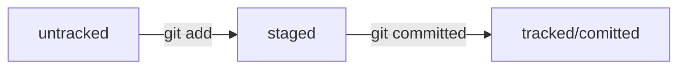

# GIT documentation
This is the summary of git functionality known till date.
## git operations
- **git iniit** - initialize repo
- **git add** - add files to be tracked
- **git commit** - *commit* the changes to repo
- **git push** - *copy* the changes from local to remote repo
## GitHub 
GitHub helps manage remote repos located on local machines that streamlines distributed development. 
*Work with Github* requires the following:
1. Github account
2. SSH keys pair to be able to work with remote repo by SSH
3. Basic knowledge of git
## Advanced features
Not known till the date.
## Git: status of files
There are several possible statuses of a file in git:  
- Untracked
- Modified 
- Tracked
- Staged
The file goes from one status to another and this is pre-defined status flow in git:  

## Commit messages
Commit messages are defined with the option **-m** and are very important for navigation, maintenance and tracking the project. Hence it is worth to have a commond message standard to be used by all the teammates working on the project.  
There are many standard that might be followed, but the crucial thing is that everyone follows the same within the team. The message should clearly define the purpose and the reason of change, be short but meaningful. 
***For example*** 
**git commit -m "Task 1: Define README structure"
